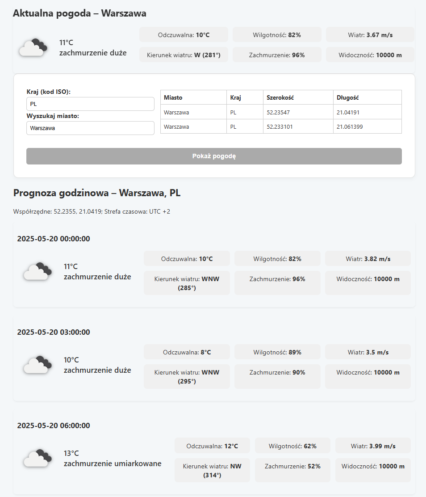

# 🌤️ Weather App – Aplikacja pogodowa (.NET Core + React)

**Weather App** to pełna aplikacja pogodowa składająca się z backendu w technologii **ASP.NET Core** oraz frontendowej aplikacji w **React**. System umożliwia odczyt i prezentację bieżących oraz prognozowanych danych pogodowych z serwisu **OpenWeather**.

---

## Wymagania

### Backend:
- [.NET SDK 8.0 lub nowszy](https://dotnet.microsoft.com/download)
- `dotnet dev-certs` zaufany (HTTPS)

### Frontend:
- [Node.js (LTS)](https://nodejs.org/) + npm

Sprawdzenie wersji:

```bash
dotnet --version
node -v
npm -v
```

## Uruchomienie i  wygląd aplikacji

**Uruchomienie i konfiguracja aplikacji opisana jest w wewnetrznych plikach readme aplikacji dla backendu w /Backend/README.md, oraz dla frontentdu w /Frontend/README.md**

Poniższe zrzut ekranu prezentujący wygląd aplikacji:

